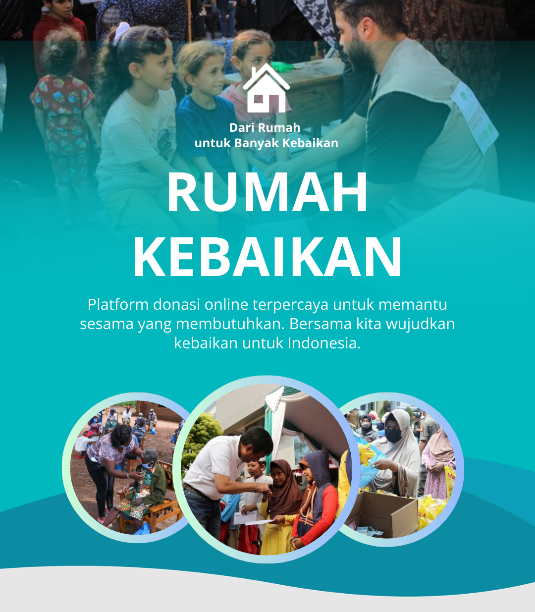
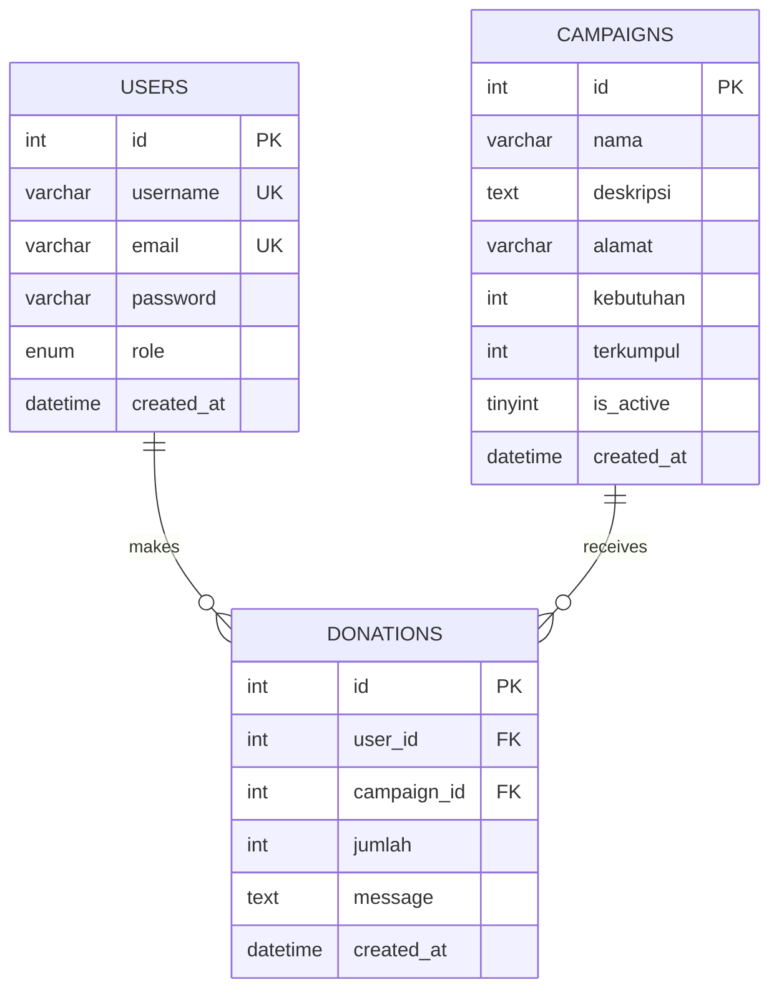

# 🏡 Rumah Kebaikan - Platform Donasi Online

<div align="center">



**Platform E-Fundraising yang Transparan dan Terpercaya**

[](https://www.python.org/)
[](https://flask.palletsprojects.com/)
[](https://www.mysql.com/)
[](LICENSE)

[Features](#-fitur-utama) •
[Demo](#-demo) •
[Installation](#-instalasi) •
[Documentation](#-dokumentasi) • 
[Security](#-keamanan)

</div>

---

## 📖 Tentang Proyek

**Rumah Kebaikan** adalah platform berbasis web yang dirancang untuk memfasilitasi penggalangan dana dan donasi secara online. Sistem ini memungkinkan pengguna untuk berkontribusi pada berbagai kampanye sosial dengan mudah, transparan, dan terorganisir.

### 🎯 Tujuan

- Memberikan platform yang mudah diakses bagi donatur dan penerima bantuan
- Meningkatkan transparansi dalam proses donasi
- Memfasilitasi pengelolaan kampanye sosial secara efisien
- Menyediakan sistem pelaporan dan tracking donasi yang jelas

---

## ✨ Fitur Utama

### 👥 Untuk Donatur

| Fitur | Deskripsi |
|-------|-----------|
| 🔍 **Eksplorasi Kampanye** | Menjelajahi berbagai kampanye sosial aktif dengan informasi lengkap |
| 💰 **Sistem Donasi** | Melakukan donasi dengan mudah dan aman, disertai pesan dukungan |
| 📜 **Riwayat Donasi** | Melihat seluruh catatan donasi yang telah dilakukan |
| 🔐 **Manajemen Akun** | Registrasi dan login untuk keamanan data donatur |

### 👨‍💼 Untuk Administrator

| Fitur | Deskripsi |
|-------|-----------|
| 📊 **Dashboard Statistik** | Memantau total donasi, jumlah donatur, dan performa kampanye |
| 🎯 **Manajemen Kampanye** | CRUD lengkap (Create, Read, Update, Delete) kampanye donasi |
| 💵 **Pemantauan Donasi** | Melihat seluruh transaksi donasi masuk secara real-time |
| 📈 **Analitik** | Statistik lengkap untuk evaluasi performa platform |

---

## 🏗️ Teknologi dan Arsitektur

### Tech Stack

```
Frontend:
├── HTML5 - Struktur halaman web
├── CSS3 - Styling dan animasi
└── Bootstrap 5.3 - Framework UI responsif

Backend:
├── Python 3.9+ - Bahasa pemrograman
├── Flask 3.0.0 - Web framework
├── Flask-WTF - CSRF protection & forms
├── Flask-Bcrypt - Password hashing
└── python-dotenv - Environment management

Database:
└── MySQL 8.0+ - Relational database

Security:
├── Bcrypt password hashing
├── CSRF protection
├── Security headers
├── Session management
└── Environment-based configuration
```

### Arsitektur Sistem

```
rumah-kebaikan/
├── app.py                 # Main application & routes
├── config.py              # Configuration management
├── db_migration.py        # Database migration script
├── requirements.txt       # Python dependencies
├── .env.example          # Environment variables template
├── .gitignore            # Git exclude patterns
│
├── models/               # Data models & business logic
│   ├── db.py            # Database connection
│   ├── UserModel.py     # User management
│   ├── CampaignModel.py # Campaign operations
│   └── DonationModel.py # Donation handling
│
├── templates/            # HTML Jinja2 templates
│   ├── layout.html      # Base template
│   ├── index.html       # Homepage
│   ├── login.html       # Login page
│   ├── register.html    # Registration page
│   ├── campaigns.html   # Campaign list
│   ├── campaign_detail.html


│   ├── donate.html      # Donation form
│   ├── my_donations.html
│   ├── dashboard.html   # Admin dashboard
│   ├── admin_campaigns.html
│   ├── admin_campaign_form.html
│   └── admin_donations.html
│
└── static/              # Static assets
    ├── style.css        # Custom CSS with teal theme
    └── *.jpg/*.png      # Images & media files
```

---

## 🗄️ Database Schema

### Entity Relationship Diagram



### Tabel Database

#### `users` - Data Pengguna
| Field | Type | Description |
|-------|------|-------------|
| `id` | INT (PK) | ID unik pengguna |
| `username` | VARCHAR(50) UK | Username login (unique) |
| `email` | VARCHAR(100) UK | Email pengguna (unique) |
| `password` | VARCHAR(255) | Password ter-hash (bcrypt) |
| `role` | ENUM('admin','donatur') | Peran pengguna |
| `created_at` | DATETIME | Waktu pendaftaran |

#### `campaigns` - Data Kampanye
| Field | Type | Description |
|-------|------|-------------|
| `id` | INT (PK) | ID unik kampanye |
| `nama` | VARCHAR(255) | Nama kampanye |
| `deskripsi` | TEXT | Deskripsi lengkap |
| `alamat` | VARCHAR(255) | Lokasi penerima bantuan |
| `kebutuhan` | INT | Target dana yang dibutuhkan |
| `terkumpul` | INT | Dana yang sudah terkumpul |
| `is_active` | TINY INT | Status aktif kampanye (0/1) |
| `created_at` | DATETIME | Waktu pembuatan |

#### `donations` - Data Donasi
| Field | Type | Description |
|-------|------|-------------|
| `id` | INT (PK) | ID unik donasi |
| `user_id` | INT (FK) | Referensi ke tabel users |
| `campaign_id` | INT (FK) | Referensi ke tabel campaigns |
| `jumlah` | INT | Jumlah donasi (Rupiah) |
| `message` | TEXT | Pesan dari donatur (opsional) |
| `created_at` | DATETIME | Waktu donasi dilakukan |

---

## 🚀 Instalasi

### Prasyarat

Pastikan sistem Anda sudah memiliki:

- ✅ **Python 3.9 atau lebih tinggi** - [Download Python](https://www.python.org/downloads/)
- ✅ **MySQL Server 8.0+** atau **XAMPP** - [Download XAMPP](https://www.apachefriends.org/)
- ✅ **Git** (opsional) - [Download Git](https://git-scm.com/)

### Langkah 1: Clone atau Download Proyek

**Menggunakan Git:**
```bash
git clone https://github.com/sasamaylina/rumah-kebaikan.git
cd rumah-kebaikan
```

**Atau download ZIP:**
Download proyek dan ekstrak ke direktori pilihan Anda.

### Langkah 2: Setup Virtual Environment

Sangat direkomendasikan menggunakan virtual environment:

```bash
# Buat virtual environment
python -m venv venv

# Aktifkan virtual environment

# Windows:
venv\Scripts\activate

# Linux/Mac:
source venv/bin/activate
```

### Langkah 3: Install Dependencies

```bash
pip install -r requirements.txt
```

Dependencies yang akan ter-install:
- Flask 3.0.0 - Web framework
- PyMySQL 1.1.0 - MySQL database driver
- Flask-Bcrypt 1.0.1 - Password hashing
- Flask-WTF 1.2.1 - CSRF protection
- python-dotenv 1.0.0 - Environment variables

### Langkah 4: Setup Database

#### A. Buat Database

1. Jalankan MySQL server (via XAMPP atau MySQL service)
2. Buka **phpMyAdmin** atau MySQL command line
3. Buat database baru:

```sql
CREATE DATABASE rumah_kebaikan CHARACTER SET utf8mb4 COLLATE utf8mb4_general_ci;
```

#### B. Import Database Schema

```sql
-- Di MySQL command line:
USE rumah_kebaikan;
SOURCE rumah_kebaikan.sql;

-- Atau via phpMyAdmin:
-- Import file > rumah_kebaikan.sql
```

### Langkah 5: Konfigurasi Environment Variables

1. **Copy template environment:**
```bash
copy .env.example .env     # Windows
cp .env.example .env       # Linux/Mac
```

2. **Edit file `.env`** dan sesuaikan dengan konfigurasi database Anda:

```env
# Flask Configuration
FLASK_APP=app.py
FLASK_ENV=development
FLASK_DEBUG=True
SECRET_KEY=your-super-secret-key-change-this-in-production

# Database Configuration
DB_HOST=localhost
DB_USER=root
DB_PASSWORD=your_mysql_password
DB_NAME=rumah_kebaikan

# Security Settings
SESSION_COOKIE_SECURE=False
SESSION_COOKIE_HTTPONLY=True
SESSION_COOKIE_SAMESITE=Lax
```

> ⚠️ **PENTING**: Ganti `SECRET_KEY` dengan string random yang aman, terutama untuk production!

### Langkah 6: Migrasi Password (Jika ada data existing)

Jika Anda sudah memiliki data user dengan plain text password, jalankan script migrasi:

```bash
python db_migration.py
```

Script ini akan:
- ✅ Men-hash semua password yang masih plain text
- ✅ Memperbaiki role yang kosong menjadi 'donatur'
- ✅ Membackup data sebelum migrasi

### Langkah 7: Jalankan Aplikasi

```bash
python app.py
```

Aplikasi akan berjalan di: **http://127.0.0.1:5000**

```
 * Running on http://127.0.0.1:5000
 * Debug mode: on
```

Buka browser dan akses URL tersebut.

---

## 🔐 Akun Default

Untuk testing, gunakan akun berikut:

| Role | Username | Password | Akses |
|------|----------|----------|-------|
| 👨‍💼 **Admin** | `admin` | `2wsx1qaz` | Manajemen kampanye & dashboard |
| 👤 **Donatur** | `donor1` | `2wsx1qaz` | Donasi & riwayat donasi |

> ⚠️ **Keamanan**: Ganti password default setelah instalasi!

---

## 🛡️ Keamanan

Proyek ini menerapkan **best practices** keamanan web modern:

### Implementasi Keamanan

| Feature | Status | Deskripsi |
|---------|--------|-----------|
| 🔒 **Password Hashing** | ✅ Implemented | Bcrypt dengan cost factor 12 |
| 🛡️ **CSRF Protection** | ✅ Implemented | Flask-WTF CSRF tokens |
| 🔐 **SQL Injection Prevention** | ✅ Implemented | Parameterized queries |
| 🚫 **XSS Protection** | ✅ Implemented | Flask auto-escaping |
| 📝 **Security Headers** | ✅ Implemented | X-Frame-Options, X-Content-Type-Options, XSS-Protection |
| 🔑 **Session Security** | ✅ Implemented | HTTPOnly, SameSite cookies |
| 🌐 **HTTPS Ready** | ✅ Ready | Secure cookies for production |
| 🔧 **Environment Config** | ✅ Implemented | Credentials tidak ter-hardcode |

### Password Policy

- ✅ Minimum 8 karakter
- ✅ Hashing menggunakan bcrypt
- ✅ Validation pada registrasi
- ✅ Secure password verification

### Session Management

- Session timeout otomatis
- HTTPOnly cookies (tidak accessible via JavaScript)
- SameSite protection
- Secure flag untuk HTTPS

---

## 📚 Dokumentasi API/Routes

### Public Routes

| Method | Route | Deskripsi |
|--------|-------|-----------|
| `GET` | `/` | Homepage dengan slideshow kampanye |
| `GET/POST` | `/login` | Halaman login pengguna |
| `GET/POST` | `/register` | Registrasi pengguna baru |
| `GET` | `/logout` | Logout dan clear session |
| `GET` | `/campaigns` | Daftar semua kampanye aktif |
| `GET` | `/campaigns/<id>` | Detail kampanye dan donasi |

### Donor Routes (Require Login)

| Method | Route | Deskripsi |
|--------|-------|-----------|
| `GET/POST` | `/campaigns/<id>/donate` | Form donasi untuk kampanye |
| `GET` | `/my-donations` | Riwayat donasi pengguna |

### Admin Routes (Require Admin Role)

| Method | Route | Deskripsi |
|--------|-------|-----------|
| `GET` | `/admin/dashboard` | Dashboard statistik admin |
| `GET` | `/admin/campaigns` | Daftar semua kampanye (termasuk non-aktif) |
| `GET/POST` | `/admin/campaigns/create` | Buat kampanye baru |
| `GET/POST` | `/admin/campaigns/<id>/edit` | Edit kampanye existing |
| `POST` | `/admin/campaigns/<id>/delete` | Hapus kampanye |
| `GET` | `/admin/donations` | Lihat semua donasi yang masuk |

---

## 🚀 Deployment

### Production Checklist

Sebelum deploy ke production, pastikan:

- [ ] Ganti `SECRET_KEY` dengan value yang aman dan random
- [ ] Set `FLASK_ENV=production` dan `FLASK_DEBUG=False`
- [ ] Set `SESSION_COOKIE_SECURE=True` (require HTTPS)
- [ ] Ganti semua password default
- [ ] Gunakan MySQL user dengan privilege terbatas (bukan root)
- [ ] Setup HTTPS/SSL certificate
- [ ] Enable firewall dan security group
- [ ] Setup backup database otomatis
- [ ] Configure logging untuk monitoring
- [ ] Review dan update `.gitignore`

### Production Server Setup

#### Menggunakan Gunicorn (Recommended)

1. **Install Gunicorn:**
```bash
pip install gunicorn
```

2. **Jalankan dengan Gunicorn:**
```bash
gunicorn --bind 0.0.0.0:8000 --workers 4 app:app
```

#### Nginx Reverse Proxy

Contoh konfigurasi Nginx:

```nginx
server {
    listen 80;
    server_name your-domain.com;

    location / {
        proxy_pass http://127.0.0.1:8000;
        proxy_set_header Host $host;
        proxy_set_header X-Real-IP $remote_addr;
        proxy_set_header X-Forwarded-For $proxy_add_x_forwarded_for;
        proxy_set_header X-Forwarded-Proto $scheme;
    }

    location /static {
        alias /path/to/rumah-kebaikan/static;
        expires 30d;
    }
}
```

### Environment Variables Production

```env
FLASK_ENV=production
FLASK_DEBUG=False
SECRET_KEY=your-production-secret-key-min-32-characters-long

DB_HOST=your-db-host
DB_USER=rumah_kebaikan_user
DB_PASSWORD=strong-database-password
DB_NAME=rumah_kebaikan

SESSION_COOKIE_SECURE=True
SESSION_COOKIE_HTTPONLY=True
SESSION_COOKIE_SAMESITE=Strict
```

---

## 🐛 Troubleshooting

### Database Connection Error

**Error:** `pymysql.err.OperationalError: (2003, "Can't connect to MySQL server")`

**Solusi:**
1. Pastikan MySQL server running
2. Cek credentials di file `.env`
3. Verifikasi database `rumah_kebaikan` sudah dibuat
4. Cek firewall MySQL port 3306

### Import Error: No module named 'flask_bcrypt'

**Solusi:**
```bash
pip install -r requirements.txt
```

### CSRF Token Missing

**Error:** CSRF validation failed

**Solusi:**
Pastikan template menggunakan CSRF token:
```html
<form method="POST">
    {{ csrf_token() }}
    <!-- form fields -->
</form>
```

### Password Login Gagal Setelah Migration

**Solusi:**
Jalankan ulang migration script:
```bash
python db_migration.py
```

---

## 🧪 Testing

### Manual Testing

1. **Test Authentication:**
```bash
# Buka browser dan test:
# - Register user baru
# - Login dengan user baru
# - Logout
# - Login dengan admin
```

2. **Test Donation Flow:**
```bash
# - Login sebagai donor
# - Browse campaigns
# - Donate ke campaign
# - Cek riwayat donasi
```

3. **Test Admin Functions:**
```bash
# - Login sebagai admin
# - Lihat dashboard statistics
# - Create new campaign
# - Edit campaign
# - Delete campaign
# - View all donations
```

---

## 📝 Contributing

Kontribusi sangat diterima! Jika Anda ingin berkontribusi:

1. Fork repository ini
2. Buat branch fitur baru (`git checkout -b feature/AmazingFeature`)
3. Commit perubahan (`git commit -m 'Add some AmazingFeature'`)
4. Push ke branch (`git push origin feature/AmazingFeature`)
5. Buat Pull Request

### Code Style Guidelines

- Gunakan Python PEP 8 style guide
- Tambahkan docstrings untuk fungsi-fungsi penting
- Gunakan parameterized queries untuk database
- Validate semua user inputs
- Tambahkan error handling yang proper

---

## 📄 License

Proyek ini menggunakan lisensi MIT. Lihat file `LICENSE` untuk detail lengkap.

---

## 👏 Credits & Acknowledgments

### Developer
- **Sasa Maylina** - Creator and Lead Developer

### Technologies Used
- [Flask](https://flask.palletsprojects.com/) - Python web framework
- [Bootstrap](https://getbootstrap.com/) - UI framework
- [MySQL](https://www.mysql.com/) - Database
- [Flask-Bcrypt](https://flask-bcrypt.readthedocs.io/) - Password hashing
- [Flask-WTF](https://flask-wtf.readthedocs.io/) - Form validation & CSRF
- [python-dotenv](https://github.com/theskumar/python-dotenv) - Environment management

### Inspirasi
Proyek ini dikembangkan dengan tujuan memberikan solusi digital untuk meningkatkan transparansi dan efisiensi dalam penggalangan dana sosial.

---

## 📞 Kontak & Support

Jika Anda memiliki pertanyaan atau membutuhkan bantuan:

- 📧 Email: support@rumahkebaikan.id
- 🐛 Issues: [GitHub Issues](https://github.com/sasamaylina/rumah-kebaikan/issues)
- 💬 Discussions: [GitHub Discussions](https://github.com/sasamaylina/rumah-kebaikan/discussions)

---

## 🗺️ Roadmap

### Version 1.0.0 (Current) ✅
- ✅ User authentication & authorization
- ✅ Campaign management (CRUD)
- ✅ Donation system
- ✅ Admin dashboard
- ✅ Security implementations

### Version 1.1.0 (Planned)
- [ ] Payment gateway integration
- [ ] Email notifications
- [ ] Campaign certification/verification
- [ ] Social media sharing
- [ ] Advanced analytics

### Version 2.0.0 (Future)
- [ ] Mobile application (iOS/Android)
- [ ] Real-time notifications
- [ ] Multi-language support
- [ ] API for third-party integration
- [ ] Advanced reporting & exports

---

<div align="center">

**🏡 Rumah Kebaikan - Dari Rumah untuk Banyak Kebaikan**

Made with ❤️ by Sasa Maylina

© 2025 Rumah Kebaikan. All Rights Reserved.

</div>
